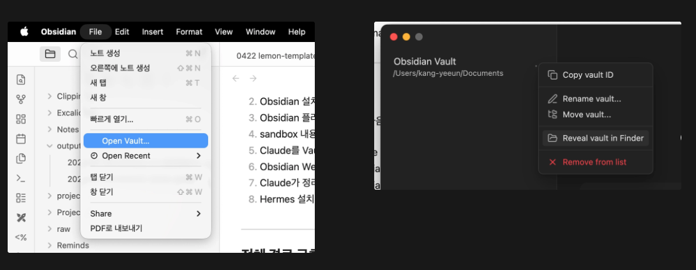
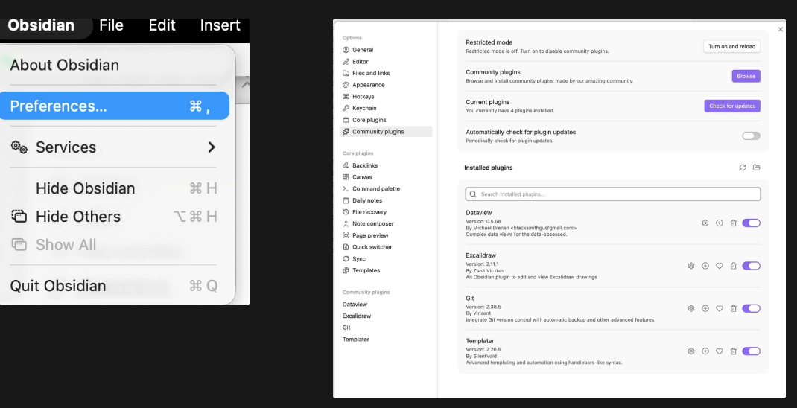
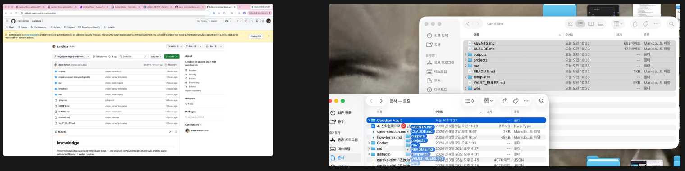
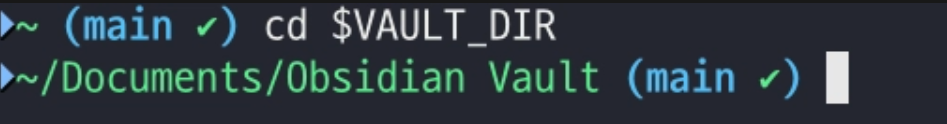
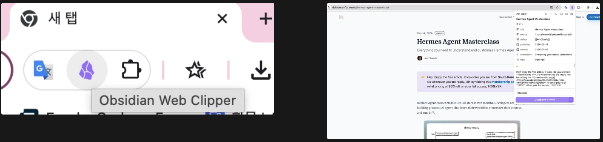
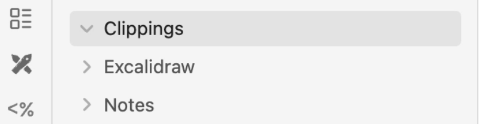
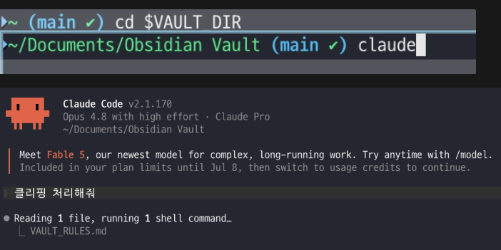
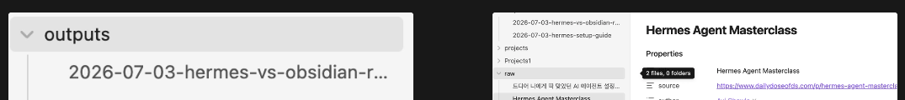

# How to Set Up Your Obsidian Wiki

Written on: 2026-07-03  

Target environment: macOS, zsh, Obsidian Vault path: `/$HOME/Documents/Obsidian Vault`

---

## Purpose

This document explains how to use Claude and Obsidian to create **your own wiki (organized notes)** and **automatically organize** web clippings.

---

## To-do checklist

- [ ]  1) Install Claude Code
- [ ]  2) Install Obsidian + fix the Vault location
- [ ]  3) Install Obsidian plugins (Templater, Dataview, Git)
- [ ]  4) Copy the contents of `sandbox` into the Vault
- [ ]  5) Run Claude from the Vault folder
- [ ]  6) Install Obsidian Web Clipper (clip content from the web)
- [ ]  7) Check Claude’s organized output in `outputs/`

---

## 1) Install Claude Code

**Install Claude Code**

---

## 2) Install Obsidian and fix the Vault location

### 2-1. Check where your Vault is

A Vault is the “folder that contains your notes.”  

On my computer it’s usually here:

`/$HOME/Documents/Obsidian Vault`

You can find the Vault location in Obsidian like in the images below.



### 2-2. Save the Vault path as an environment variable in the terminal

```bash
export VAULT_DIR="$HOME/Documents/Obsidian Vault"
```

If your Vault is somewhere else on your computer, change it to your folder path. Example:

```bash
export VAULT_DIR="/Users/kang-yeeun/Documents/Obsidian Vault"
```

---

## 3) Obsidian plugin setup: Templater, Dataview, Git

Preferneces → community plugin



---

## 4) Copy GitHub `sandbox` contents into the Vault

Download `sandbox` from here:  

https://github.com/steve-lemon/sandbox

When copying, make sure the “contents inside the sandbox folder” go into the Vault.  

(See the images below.)



---

## 5) Run Claude from the Vault folder

In the terminal, enter the line below in order.

```bash
cd "$VAULT_DIR"
```

(As shown below, go into the Vault folder and then run Claude.)



---

## 6) Clip from the web with Obsidian Web Clipper

1) Install this in Chrome:  

https://chromewebstore.google.com/detail/obsidian-web-clipper/cnjifjpddelmedmihgijeibhnjfabmlf?hl=ko



2) As a test, clip this article (sample):  [hermes](https://www.dailydoseofds.com/p/hermes-agent-masterclass/)

Then check the Obsidian Clippings folder to make sure it was clipped properly.



3) Tell Claude this: **"Process the clipping"**



---

## 7) Check the organized results (`outputs/`)

After the clipping is processed, check these folders in Obsidian.

- `outputs/`: the organized results Claude created
- `raw/`: the original files that came in from the clipping

Example screen:



---
